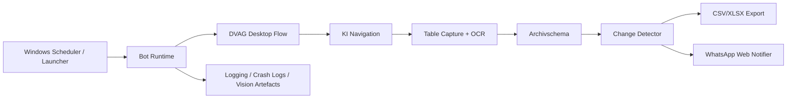

# MVP Architektur

## Ziel

Die Anwendung soll Daten aus `KI` auslesen, Änderungen erkennen, diese lokal als Archiv in `CSV/XLSX` protokollieren und relevante Updates optional an eine interne WhatsApp-Gruppe weitergeben.

## Systemübersicht



## Laufzeitablauf

1. Bot startet lokal.
2. Er verbindet sich mit laufendem `KI` oder startet `smartclient.exe`.
3. Er passiert Login, 2FA, `VB-Portal` und `Mitteilungen`.
4. Er bringt `KI` in einen stabilen visuellen Zustand.
5. Er navigiert nach `VBI -> Gruppen-Akte -> Eingereichtes Geschäft -> Einheiten nach Sparten der Gruppe`.
6. Er erkennt per Template-Matching, ob dieser Zielzustand bereits offen ist.
7. Er capturt den mittleren Tabellenbereich.
8. Er liest die Tabelle per OCR aus.
9. Er überführt die Daten in ein internes Archivschema.
10. Er exportiert Snapshot und Changes.
11. Er sendet optional WhatsApp-Nachrichten.

## Hauptmodule

### `connectors/ki-desktop.ts`

Verantwortlich für:

- Start von `smartclient.exe`
- Erkennung der Fensterphasen `login`, `portal`, `main`
- Schließen der vorgeschalteten News-/Mitteilungsfenster
- Fenster-Handling inkl. Restore/Maximize/Re-Minimize
- Navigation bis zur Tabellenansicht

### `vision/tree-capture.ts`

Verantwortlich für:

- Screenshots definierter KI-Bildbereiche
- Tree-Capture
- Header-/Pfad-Capture
- Tabellen-Capture
- Vordergrundaktivierung des richtigen KI-Fensters vor Screenshots

### `vision/match.ts`

Verantwortlich für:

- bildbasiertes Template-Matching
- Erkennung des bereits offenen Zielzustands

### `vision/ocr.ts`

Verantwortlich für:

- Tabellen-Capture per OCR lesen
- Rohtext plus positionsbasiertes TSV auswerten
- Namen, Sparten und Werte in strukturierte Tabellenzeilen überführen
- deutsche Sprachdaten aus lokalem Repo-Ordner `data/tessdata` nutzen

### `connectors/ki.ts`

Verantwortlich für:

- echten Tabellenlesefluss aufrufen
- OCR-Zeilen in `SalesRecord[]` überführen

### `detectors/changes.ts`

Verantwortlich für:

- Vergleich altes vs. neues Archiv
- neue Einträge
- Statusänderungen
- Änderungen am `unitsValue`
- `updated`
- `removed`

### `exporters/csv.ts` / `exporters/xlsx.ts`

Verantwortlich für:

- Snapshot-Export
- Change-Export
- feste `snapshot-current.*`-Dateien statt timestamp-basierter Exportflut
- UTF-8-BOM für CSV, damit Umlaute in Excel korrekt bleiben

### `notifiers/whatsapp-web.ts`

Verantwortlich für:

- Öffnen von WhatsApp Web im konfigurierten Profil
- Gruppensuche
- Nachricht senden

Wichtig:

- Ein WhatsApp-Fehler darf den Archivlauf nicht mehr abbrechen.
- Auf Geräten ohne korrektes Office-Profil ist ein Scheitern erwartbar.

## Aktuelle fachliche Datenquelle

Pfad:

1. Reiter `VBI`
2. `Gruppen-Akte`
3. `Eingereichtes Geschäft`
4. `Einheiten nach Sparten der Gruppe`
5. mittlere Tabelle

Aktuell gelesene Felder:

- `partnerStage`
- `partnerName`
- `productName`
- `unitsValue`
- `totalUnits`
- `evaluationPeriod`
- `businessScope`
- `sourcePage`

## Archivschema

```json
{
  "businessId": "AL:Bo_hme_Erik:Leben",
  "partnerStage": "AL",
  "partnerName": "Böhme, Erik",
  "productName": "Leben",
  "status": "eingereicht",
  "unitsValue": 64.8,
  "totalUnits": 70.8,
  "evaluationPeriod": "04.2026",
  "businessScope": "\\VB- und VM-Geschäft",
  "sourcePage": "Einheiten nach Sparten der Gruppe im Eigengeschäft",
  "submittedAt": "2026-04-02T22:35:27.637Z",
  "updatedAt": "2026-04-02T22:35:27.637Z",
  "source": "KI"
}
```

## Arten von Änderungen

- `created`
- `status_changed`
- `units_value_changed`
- `updated`
- `removed`

## Vision-/OCR-Strategie

### Für Navigation

Bildanker:

- `tree-submitted-units-selected.png`
- `content-open-path.png`

Sie werden genutzt, um den offenen Zielzustand zu erkennen und Klicks zu überspringen.

### Für Tabelle

Strategie:

- gezielter Tabellen-Capture
- OCR auf vergrößerter Version
- TSV-Parsing zur Spaltenzuordnung
- Rohtext als Fallback für Umlaute und Namen

## WhatsApp-Absicherung

WhatsApp ist funktional optional.

Praktische Regeln:

1. Archiv und State dürfen immer geschrieben werden.
2. WhatsApp darf nur Zusatzkanal sein.
3. Fehler im WhatsApp-Teil dürfen keinen kompletten Lauf mehr blockieren.
4. Das korrekte Browserprofil ist auf dem Arbeits-PC entscheidend.

## Exportverhalten

Der aktuelle Zielmodus ist:

- Snapshot-Dateien bleiben fest unter `data/exports`
- nur bei echten fachlichen Änderungen wird neu exportiert
- bei unveränderten KI-Daten passiert kein neuer Export
- der interne Arbeitsstand bleibt unter `data/state/current-state.json`

## Betriebsarten

### Debug / Diagnostik

- `--inspect-ki`
- `--navigate-ki-source`
- `--capture-ki-tree`
- `--capture-ki-header`
- `--capture-ki-table`
- `--capture-ki-templates`
- `--match-ki-templates`
- `--read-ki-table`

### Produktiv

- `--once`
- später Polling / Scheduler

## Aktueller Stand

Stand jetzt:

- Desktop-Startpfad bis `KI`: verifiziert
- interne Navigation bis Zielansicht: verifiziert
- Zielzustandserkennung über Templates: verifiziert
- Tabellenlesung per OCR: verifiziert
- Archivexport CSV/XLSX: verifiziert
- WhatsApp auf Privat-PC: erwartbar unzuverlässig wegen falschem Profil

## Empfohlene nächste Schritte

1. Arbeits-PC mit echtem Office-WhatsApp-Profil verifizieren.
2. Prüfen, ob `businessId` fachlich anders aufgebaut werden soll.
3. Scheduler-/Tageslauf auf Arbeits-PC testen.
4. Danach Logging und Notification-Texte fachlich feinschleifen.
