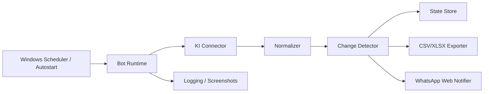

# MVP Architektur

## Ziel

Die Anwendung soll Verkaufsdaten aus dem internen Programm `KI` auslesen, Aenderungen erkennen, diese lokal archivieren und relevante Updates in eine interne WhatsApp-Gruppe posten.

## Systemuebersicht



## Laufzeitablauf

1. Der Bot startet lokal ueber Windows-Login oder Task Scheduler.
2. Er laedt Konfiguration und letzten Zustand.
3. Er verbindet sich mit einem persistenten Browserprofil.
4. Er prueft, ob `KI` erreichbar und in eingeloggtem Zustand ist.
5. Er liest den aktuellen Datenbestand aus.
6. Er normalisiert die Daten in ein einheitliches internes Format.
7. Er vergleicht den neuen Snapshot mit dem letzten bekannten Snapshot.
8. Er exportiert relevante Aenderungen.
9. Er sendet nur bei echten Aenderungen eine WhatsApp-Meldung.
10. Er speichert den neuen Zustand und wartet bis zum naechsten Lauf.

## Hauptmodule

### `connectors/ki.ts`

Verantwortlich fuer:

- Navigation in der `KI`
- Auslesen der Live-Daten
- Extraktion der fachlich relevanten Felder
- Fehlerbehandlung bei Ladefehlern, Session-Verlust oder Popups

### `detectors/changes.ts`

Verantwortlich fuer:

- Vergleich von altem und neuem Snapshot
- Erkennung neuer Geschaefte
- Erkennung von Statusaenderungen
- Erkennung relevanter Wertaenderungen
- Entdoppelung bereits gemeldeter Ereignisse

### `exporters/csv.ts` und `exporters/xlsx.ts`

Verantwortlich fuer:

- revisionssichere Archivierung pro Lauf
- Delta-Export oder Vollsnapshot
- spaetere Weitergabe fuer Reporting

### `notifiers/whatsapp-web.ts`

Verantwortlich fuer:

- Oeffnen oder Uebernehmen des Browserkontexts
- Suchen und Validieren der Zielgruppe
- Schreiben und Senden von Nachrichten
- Rueckpruefung, ob die Nachricht sichtbar im Chatverlauf steht

### `state/store.ts`

Verantwortlich fuer:

- Persistenz des letzten bekannten Snapshots
- Speicherung bereits gemeldeter Ereignisse
- technische Metadaten pro Lauf

## Datenmodell

```json
{
  "businessId": "A12345",
  "customerName": "Max Mustermann",
  "productName": "XYZ Schutzbrief",
  "status": "eingereicht",
  "salesValue": 1234.56,
  "submittedAt": "2026-03-30T08:15:00+02:00",
  "updatedAt": "2026-03-30T08:15:00+02:00",
  "source": "KI"
}
```

## Arten von Aenderungen

- `created`
- `status_changed`
- `sales_value_changed`
- `updated`
- `removed`

## Zustandsdateien

Empfohlene Dateien unter `data/state/`:

- `current-state.json`
- `last-run.json`
- `sent-events.json`

## WhatsApp Web Absicherung

Damit das Posting nicht versehentlich im falschen Chat landet, sollte der Notifier mindestens Folgendes pruefen:

1. WhatsApp Web ist geladen und verbunden.
2. Der Suchdialog ist bereit.
3. Der gefundene Chatname entspricht exakt dem konfigurierten Gruppennamen.
4. Der aktive Header des offenen Chats entspricht exakt dem Zielnamen.
5. Der Nachrichtentext wurde korrekt in das Eingabefeld eingefuegt.
6. Nach dem Senden ist die Nachricht im Verlauf sichtbar.

## Betriebsarten

### Modus A: Polling

- Intervall z. B. alle `5` Minuten
- einfacher fuer Version 1
- geeignet fuer Bots auf einem Arbeitsrechner

### Modus B: Session-basierter Tageslauf

- Start morgens durch Nutzer
- manuelle Login-Pruefung nur einmal
- anschliessend Tagesbetrieb mit Intervallpruefung

## MVP Grenzen

- keine fertigen Selektoren fuer eure reale `KI`
- kein produktionsreifer Wiederanlauf nach Browser-Absturz
- keine API-Integration fuer WhatsApp Business Platform
- keine serverseitige Ausfuehrung

## Empfohlene Roadmap

### Phase 1

- `KI`-Daten im Browser sichtbar auslesen
- lokal als JSON und `CSV` speichern
- keine WhatsApp-Integration

### Phase 2

- Delta-Erkennung
- formatierte WhatsApp-Meldung
- Logging und Screenshots

### Phase 3

- `XLSX`-Export
- Retry-Strategien
- Monitoring
- dedizierter Bot-Rechner
